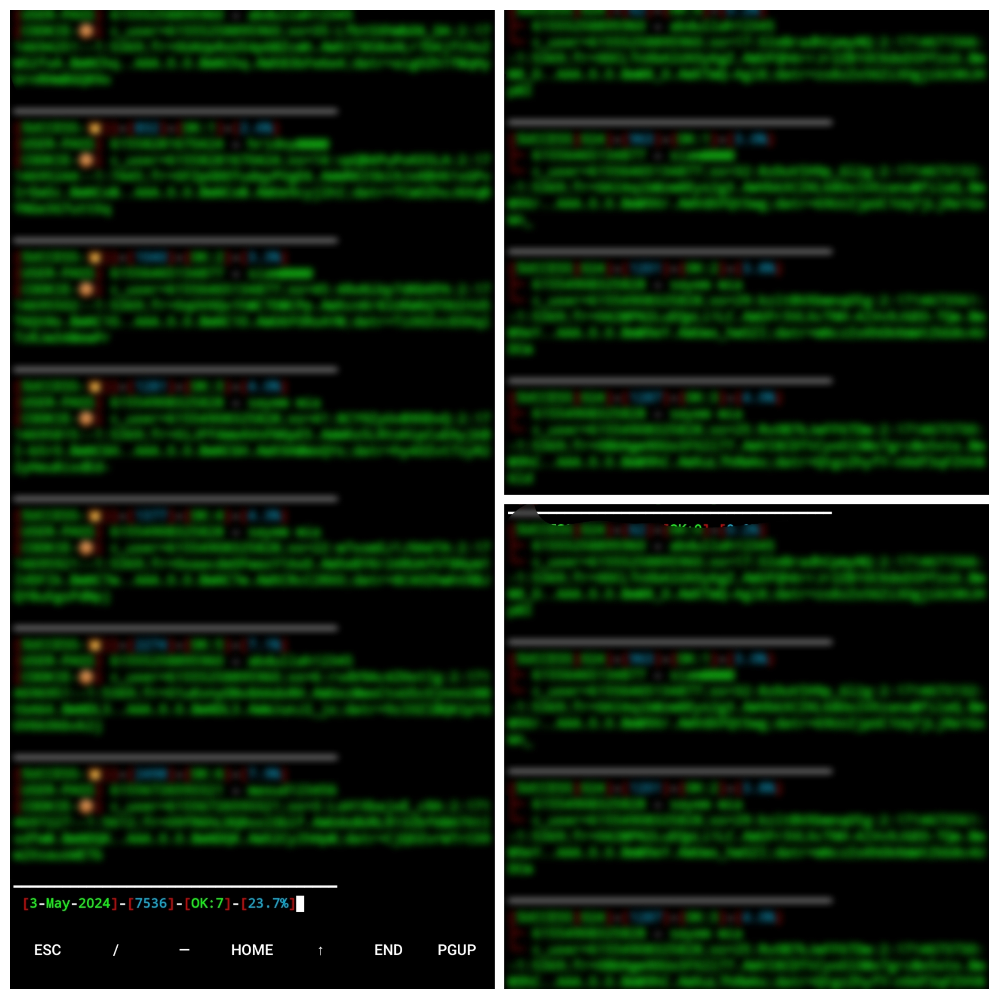

## Screen Short :black_heart:

<p align="center"></p>


<b></b> </br> <br>[](https://github.com/AHMED-143)<br> [](https://www.facebook.com/FarHan.YouR.FatHer.OkH.bbY)<br> [](https://wa.me/+8801843961233)<br> [](https://t.me/T4R0X)


<h1 align="center"> [𝗔𝗛𝗠𝗘𝗗 𝗙𝗔𝗥𝗛𝗔𝗡]</h1>

<h2 align="center"> 𝗙𝗜𝗟𝗘 𝗫 𝗥𝗔𝗡𝗗𝗢𝗠 𝗖𝗟𝗢𝗡𝗜𝗡𝗚 𝗧𝗢𝗢𝗟𝗦 </h2>


## :shield: 𝗧𝗢𝗢𝗟𝗦 𝗙𝗘𝗔𝗧𝗨𝗥𝗘 

- **𝗙𝗘𝗔𝗧𝗨𝗥𝗘 1**: 𝗙𝗜𝗟𝗘 𝗖𝗟𝗢𝗡𝗘
- **𝗙𝗘𝗔𝗧𝗨𝗥𝗘 2**: 𝗥𝗔𝗡𝗗𝗢𝗠 𝗖𝗟𝗢𝗡𝗘

## :skull: 𝗧𝗢𝗢𝗟𝗦 𝗜𝗡𝗦𝗧𝗔𝗟𝗟𝗔𝗧𝗜𝗢𝗡 
```
rm -rf MR-PRIME
git clone https://github.com/PRIME-404/MR-PRIME.git
cd MR-PRIME
chmod 777 MR-PRIME
git pull
./PRIME
```
## :ballot_box_with_check: 𝗥𝗨𝗡 𝗦𝗛𝗢𝗥𝗧 𝗖𝗢𝗠𝗠𝗔𝗡𝗗 
```    
cd MR-PRIME
chmod 777 MR-PRIME
git pull
./PRIME
```

```✍️ 𝗡𝗢𝗧𝗘 : 𝗧𝗛𝗜𝗦 𝗧𝗢𝗢𝗟𝗦 𝗜𝗦 𝗙𝗥𝗘𝗘 𝗕𝗨𝗧 𝗬𝗢𝗨 𝗡𝗘𝗘𝗗 𝗔𝗣𝗣𝗥𝗢𝗩𝗔𝗟 𝗙𝗢𝗥 𝗨𝗦𝗘 𝗧𝗛𝗜𝗦 𝗧𝗢𝗢𝗟𝗦 ```</br>
[](https://wa.me/+8801843961233)
